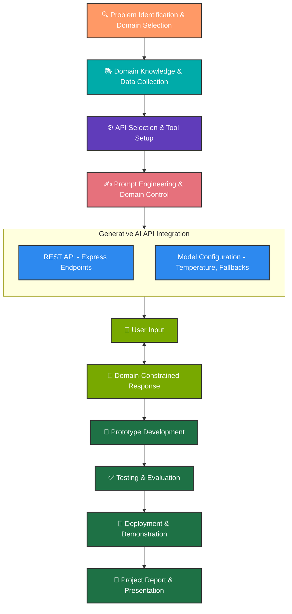
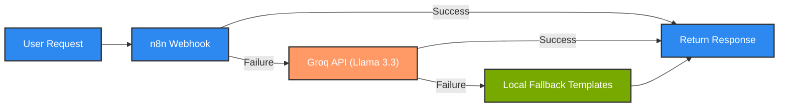

# 🐉 Dungeons & Dragons AI Assistant

A state-of-the-art, domain-specific AI platform designed to empower Dungeon Masters and players with immersive lore, cinematic narratives, and mechanical consistency.

---

## 📖 Introduction

The **D&D AI Assistant** (Lore Assistant) is a full-stack application that leverages advanced Large Language Models (LLMs) to automate the most complex aspects of tabletop world-building. By integrating domain-specific prompt engineering with a multi-layered fallback architecture, the system ensures that every campaign hook, character backstory, and quest objective feels authentic to the high-fantasy genre.

Whether you're struggling with "Writer's Block" or need a detailed cinematic story arc in seconds, this assistant bridges the gap between raw AI potential and tabletop-ready content.

---

## 🛠️ Stages of Domain-Specific AI Chatbot Development

The following flowchart outlines the complete development lifecycle of this domain-specific AI chatbot, from initial problem identification to final deployment and demonstration.



### Stage Breakdown

| Stage | Description | Tools / Techniques |
|-------|-------------|--------------------|
| **Problem Identification** | Selected the D&D tabletop RPG domain due to its rich, structured lore requirements | Domain analysis, user research |
| **Domain Knowledge** | Collected D&D rules, lore patterns, character archetypes, and quest structures | SRD references, community resources |
| **API Selection & Setup** | Configured n8n workflow automation, Groq inference, and Express REST API | n8n, Groq API, Node.js, Express |
| **Prompt Engineering** | Designed structured prompts for campaigns, characters, quests, and cinematic stories | Few-shot prompting, output formatting |
| **AI API Integration** | Built multi-model fallback engine with temperature and token controls | REST endpoints, model chaining |
| **User Interaction** | Users submit structured inputs (theme, tone, difficulty) and receive markdown lore | Frontend forms, JSON payloads |
| **Prototype & Testing** | Iterative development with real-time testing of generation quality | Manual QA, log analysis |
| **Deployment** | Deployed on Render as a production web service | Render Web Service, GitHub CI |

---

## ✨ Key Features

- **🎭 Campaign Generator** — Craft complete campaign settings with antagonists, story arcs, NPCs, and session-zero tips.
- **⚔️ Character Creator** — Generate detailed character profiles with backstories, personality traits, and growth hooks.
- **🗺️ Quest Builder** — Design playable quests with encounter flows, enemies, loot tables, and failure consequences.
- **📖 Cinematic Story Weaver** — Combine campaign + character + quest into a massive, multi-chapter narrative.
- **🤖 Lore Assistant Chatbot** — A persistent sidebar helper that auto-fills creative suggestions.
- **🔄 Multi-Model Fallback** — Primary: n8n webhooks → Fallback: Groq (Llama 3.3) → Local templates.
- **💾 Session Memory** — Maintains context across generations within a session.

---

## 🚀 Tech Stack

| Layer | Technology |
|-------|-----------|
| **Frontend** | HTML5, Vanilla JavaScript, CSS3 (Custom Dark Theme) |
| **Backend** | Node.js, Express.js |
| **AI Automation** | n8n (Workflow Webhooks) |
| **AI Inference** | Groq (Llama-3.3-70b, Llama-3.1-8b, Mixtral-8x7b) |
| **Logging** | Morgan (HTTP), Custom structured console logs |
| **Hosting** | Render (Web Service) |

---

## 📁 Project Structure

```
Dungeons-Dragons-AI-Assistant/
├── client/
│   ├── index.html          # Main UI with generator forms
│   ├── app.js              # Frontend logic and API calls
│   ├── chatbot.js          # Lore Assistant sidebar chatbot
│   └── styles.css          # Dark-themed custom design system
├── server/
│   └── .env                # Environment variables (API keys)
├── server.js               # Express backend with AI integration
├── package.json            # Dependencies and scripts
└── Readme.md               # This file
```

---

## 🔧 Installation & Setup

### Prerequisites
- Node.js (v18+)
- npm
- A [Groq API Key](https://console.groq.com/)

### Steps

1. **Clone the repository**:
   ```bash
   git clone https://github.com/your-username/Dungeons-Dragons-AI-Assistant.git
   cd Dungeons-Dragons-AI-Assistant
   ```

2. **Install dependencies**:
   ```bash
   npm install
   ```

3. **Configure environment variables**:
   Edit `server/.env`:
   ```env
   PORT=5001
   AI_PROVIDER=n8n
   AI_FALLBACK_MODE=groq
   N8N_WEBHOOK_URL=your_n8n_webhook_url
   GROQ_API_KEY=your_groq_api_key_here
   GROQ_MODEL=llama-3.3-70b-versatile
   GROQ_FALLBACK_MODELS=llama-3.1-8b-instant,mixtral-8x7b-32768
   ```

4. **Run the application**:
   ```bash
   npm run dev
   ```

5. **Open in browser**:
   Navigate to `http://localhost:5001`

---

## 🌐 API Endpoints

| Method | Endpoint | Description |
|--------|----------|-------------|
| `GET` | `/api/health` | Health check |
| `POST` | `/api/generate-campaign` | Generate a campaign setting |
| `POST` | `/api/generate-character` | Generate a character profile |
| `POST` | `/api/generate-quest` | Generate a playable quest |
| `POST` | `/api/generate-whole-story` | Generate a cinematic multi-chapter story |
| `POST` | `/api/generate-story` | Generate a short cinematic story |
| `POST` | `/api/helper-suggestions` | Get AI-powered creative suggestions |

---

## 🔄 Fallback Architecture



---

## 📊 Logging & Monitoring

The application includes structured logging for easy debugging:

```
[API]    Received campaign request: { theme: "...", tone: "..." }
[Groq]   Starting generation attempt. Prompt preview: "..."
[Groq]   Trying model: llama-3.3-70b-versatile
[Groq]   SUCCESS with model: llama-3.3-70b-versatile
[API]    campaign generation successful for session: sess_1234_abc
```

---

## 📜 License

Distributed under the MIT License. See `LICENSE` for more information.

---

## 👤 Author

**Rohith Ravirala**  
LPU — B.Tech CSE  
INT 428 — Artificial Intelligence Engineering
